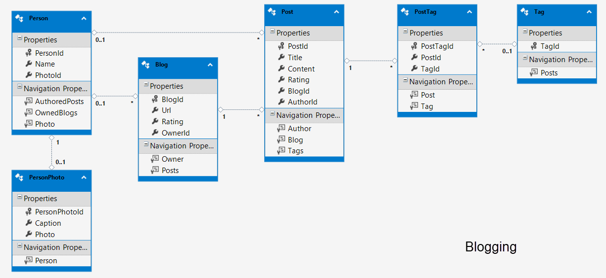

Der er i øjeblikket et problem med at Seeding Data delen af migration ikke kan finde ud af at oprette Blog-objekter hvis der findes en værdi for OwnerId. Det kan dog hurtigt fixes ved at hardkode nogle værdier i databasen.
